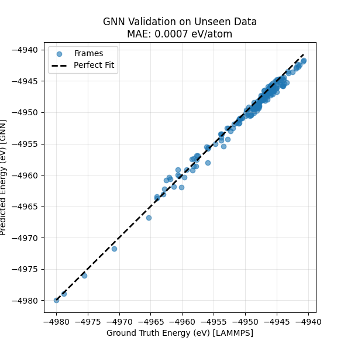

# Physics-Informed GNN for Atomic Potentials (Technical Proof-of-Concept)

> **DISCLAIMER:** This repository is a technical proof-of-concept developed to demonstrate the architectural implementation of Graph Neural Networks (GNNs) from first principles. It focuses on the rigorous application of Deep Learning and Physics-ML concepts (autograd, conservative fields, differentiable geometry) rather than serving as a production tool.

## Project Overview

A custom **Graph Neural Network (GNN)** was implemented to predict the Potential Energy Surface (PES) of a Platinum crystal with defects.

Instead of relying on high-level libraries, the **Message Passing** and **Spatial Convolution** logic were built using raw PyTorch tensors.

### Implementation Decisions
The architecture was implemented from scratch to demonstrate direct control over the computational graph:
1.  **Low-Level Implementation:** The adjacency matrix ($A$) and feature aggregation ($A \cdot H \cdot W$) were manually constructed.
2.  **Physics-First Design:** Physical constraints were explicitly modeled, including a custom **Minimum Image Convention** for Periodic Boundary Conditions (PBCs).
3.  **Conservative Force Field:** Forces were not predicted as a separate output. Scalar Energy was predicted and PyTorch's `autograd` engine was utilized to derive Forces analytically ($F = -\nabla E$), guaranteeing a curl-free vector field.

### Training Data
The model was trained on synthetic data generated via LAMMPS using an Embedded Atom Method (EAM) potential.
* **Rationale:** EAM was chosen over DFT for this demo to allow for rapid iteration and data generation (~200 uncorrelated frames) during the architectural debugging phase.
* **Surrogate Modeling:** The model serves as a surrogate for the EAM potential. The pipeline allows training data to be swapped for DFT/Ab-Initio data without changing the model architecture.

---

## Key Features

* **Custom GNN Layer:** A lightweight spatial convolution with Gaussian-expanded edge features and SiLU activation.
* **Differentiable PBCs:** A custom `get_pbc_distances` function was created to handle boundary wrapping within the compute graph, allowing gradients to flow through periodic boundaries.
* **Hybrid Loss Function:** Training was performed on a weighted combination of Energy (global scalar) and Forces (local vectors).

  ```text
  Loss = MSE(E_pred, E_ref) + lambda * MSE(-grad(E_pred), F_ref)
  ```

* **Extensivity:** Local environments are learned by the model, allowing it to scale from 100 atoms (training) to 800+ atoms (inference) without retraining.

---

## Results

The model was trained on small **108-atom** supercells and tested on an unseen **864-atom** system with defects.

| Metric | Result | Target (Chemical Accuracy) |
| :--- | :--- | :--- |
| **MAE (Energy)** | **0.7 meV/atom** | 43 meV/atom (1 kcal/mol) |
| **Transferability** | **Successful** | Model generalized to 8x larger box |

### Parity Plot (Unseen Test Data)


*The tight diagonal correlation demonstrates that the underlying physics of the Potential Energy Surface was learned, rather than simply memorizing coordinates.*

---

## Repository Structure

```text
.
├── data/
│   ├── training_data.xyz    # Generated via LAMMPS (Melt-Quench-Rattle)
│   ├── test_data.xyz        # Unseen trajectory (different random seed)
│   └── Pt_u3.eam            # EAM potential file
├── train_gnn.py             # Main training loop (PyTorch)
├── predict.py               # Inference & Validation script
├── runscript_gnn.slurm      # HPC submission script
└── best_model.pth           # Saved model weights
```

---

## Usage

### 1. Prerequisites
* Python 3.8+
* PyTorch
* NumPy
* Matplotlib

### 2. Training
The training script parses the LAMMPS trajectory, normalizes the energy against a reference ($E_{ref}$), and optimizes the network using Adam.

```bash
python train_gnn.py
```
* **Input:** `data/training_data.xyz`
* **Output:** `best_model.pth`

### 3. Testing / Inference
To validate the model on the held-out dataset and generate the parity plot:

```bash
python predict.py
```
* **Input:** `data/test_data.xyz` & `best_model.pth`
* **Output:** `prediction_parity.png` & Metrics printed to console.

### 4. Continuous Integration
This repository includes a lightweight GitHub Actions workflow at `.github/workflows/ci.yml` that runs on pushes and pull requests. The job:

1. Sets up Python 3.10
2. Installs dependencies from `requirements.txt`
3. Byte-compiles the entrypoints (`train_gnn.py`, `predict.py`)

To run the same check locally:

```bash
python -m pip install --upgrade pip
python -m pip install -r requirements.txt
python -m compileall train_gnn.py predict.py
```

---

## Technical Details (The Math)

The model relies on a **Spatial Graph Convolution** where the graph topology is dynamic and defined by continuous interatomic distances.

### 1. Adjacency Matrix Construction
Unlike standard GNNs that use binary edges (0 or 1), a **Weighted Soft Adjacency Matrix** ($A$) was constructed based on the radial distance between atoms via the helper function `get_pbc_distances`.

**A. Minimum Image Convention (PBCs):**
To ensure the graph respects the crystal lattice, distances are calculated using a differentiable Minimum Image Convention:

$$\vec{\delta}_{ij} = (\vec{x}_j - \vec{x}_i) - \text{Box} \cdot \text{round}\left( \frac{\vec{x}_j - \vec{x}_i}{\text{Box}} \right)$$

**B. Gaussian Radial Basis Function (RBF):**
The elements of the adjacency matrix $A_{ij}$ are defined by a Gaussian kernel centered at the equilibrium bond length ($\mu \approx 2.77 \text{ Å} $):

$$A_{ij} = \exp \left( - \frac{(\Vert \vec{\delta}_{ij} \Vert - \mu)^2}{\sigma^2} \right)$$

### 2. Message Passing Update
The feature update rule for atom $i$ at layer $l+1$ is a spatial convolution of its neighbors' features weighted by this adjacency matrix:

$$h_i^{(l+1)} = \text{SiLU} \left( \sum_{j \in \mathcal{N}(i)} A_{ij} \cdot (W \cdot h_j^{(l)}) \right)$$

This architecture effectively mimics a learnable continuous interaction potential, where the interaction strength decays smoothly with distance.

---
## License
MIT License. Feel free to use this code for educational purposes or as a template for custom MLFF development.
